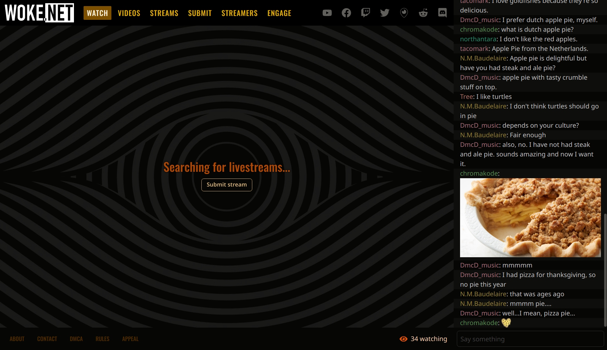

# Anchor

Anchor is the live streaming community website that powers
[WOKE.NET](https://woke.net).

The chat is powered by the open [Matrix](https://matrix.org) protocol. We use a
few custom state keys to dynamically update the stream on the page as well as
real-time announcements. This supports our own video hosting (also open source;
see [our Ansible repository for details][ansible]), as well as embedding
Twitch, YouTube, and Facebook live streams directly.

Our grid of livestreams is curated using [Streamwall][streamwall]. Curators use
[anchorbot][anchorbot] commands to update announcements and the livestream.

## How to contribute

Want to add a feature, fix a bug, or discuss an idea? We'd love to collaborate!

Drop us a line in:

 - Matrix: [#anchor-development:woke.net][anchor-development]
-  Discord: #anchor on the [WOKE.NET Discord][discord]

[ansible]: https://github.com/wokenet/ansible/tree/main/roles/streamwall/tasks
[streamwall]: https://github.com/streamwall/streamwall
[anchorbot]: https://github.com/wokenet/anchorbot
[anchor-development]: https://matrix.to/#/#anchor-development:woke.net
[discord]: https://woke.net/discord
